# 🏈 DraftKnight

## 📱 Description
During my internship with Emory University's AppHatchery, I have been able to really focus on the design side of product development for the first time. I wanted to reinforce the design principles I have been learning, and so I decided to use it as an opportunity to explore something else I have been extremely interested in; iOS development!

DraftKnight is essentially a mobile version of a popular web-based game amongst NFL fans (https://nflperry.com/game-mode). The objective is to reach the highest # of fantasy points by picking a player from a given randomized team without knowing which teams you will get in the future. 

## 🎮 How To Play! (only local in xcode currently :/)
```bash
git clone https://github.com/pchryss/DraftKnight
cd DraftKnight
``` 
Open. `HomeView.swift` in XCode and open the Canvas to preview the game.

## 🛠️ Tools
Design : Figma
Development : Swift, SwiftUI
Database : Firestore

## 🗺️ Roadmap
* Authentication
* Personal Leaderboards
* Launch to App Store!
* Multiplayer Support

## 📸 Dev Log

### July 13, 2025
Implemented the redesign
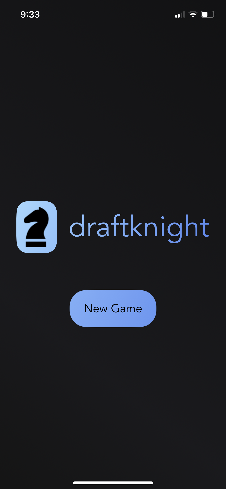
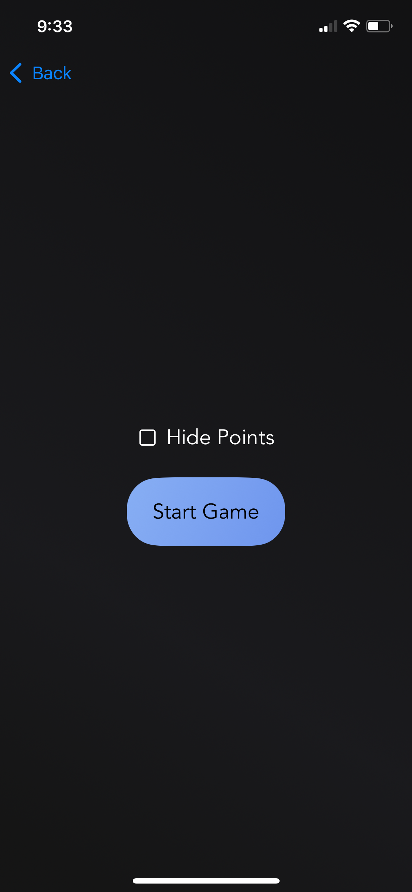
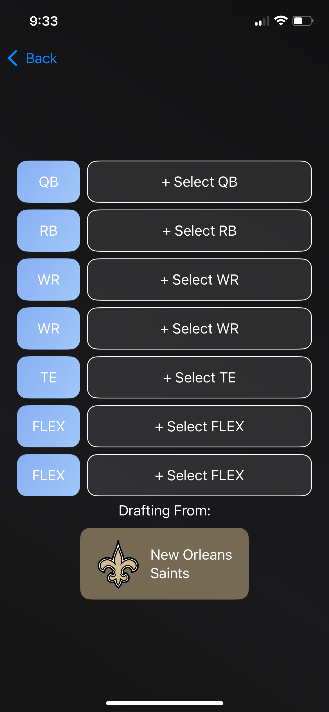

### July 12, 2025
Redesign! Decided on the name "DraftKnight" (play on words with draft night😅) and a much more visually appealing color scheme
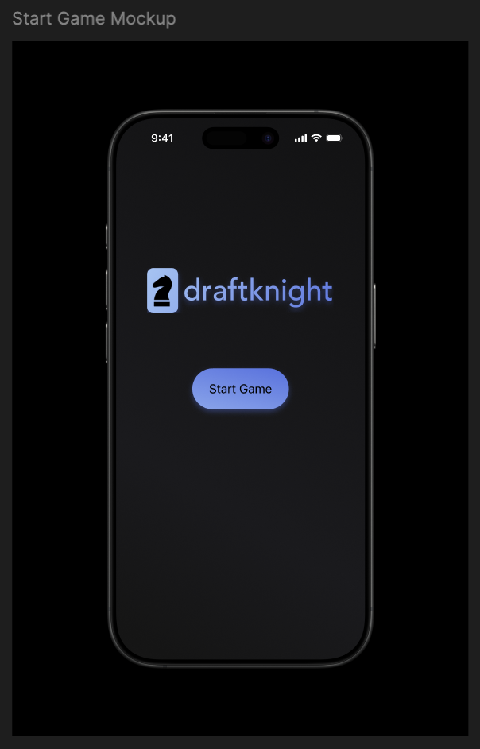

### July 3, 2025
Designed and implemented the incramental search feature needed to play the game
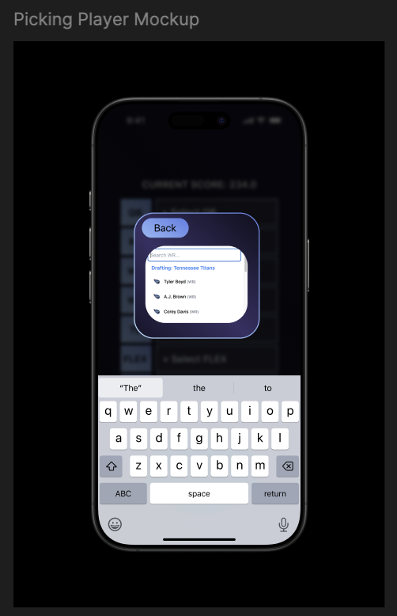
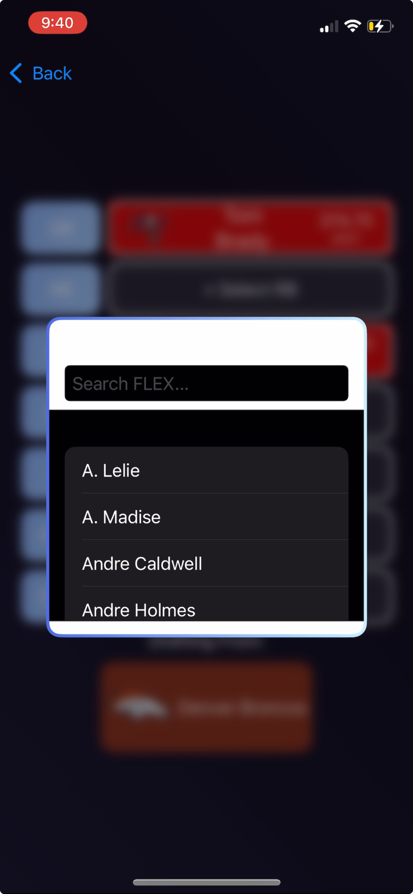


### June 23, 2025
Began development! Development went pretty slow as it was my first time working with Swift / mobile development, but I was able to implement the three screens I had designed.

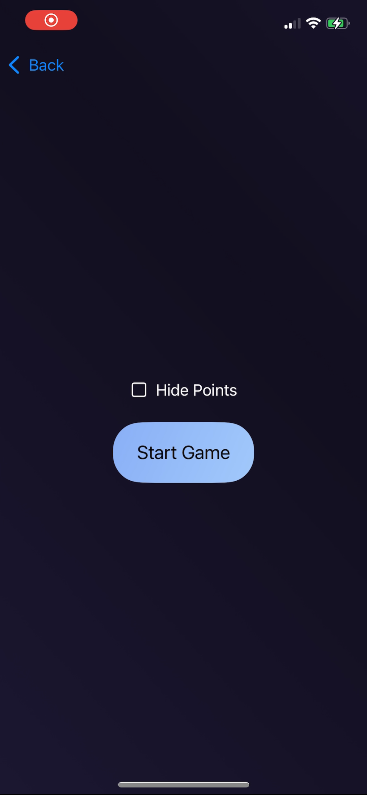
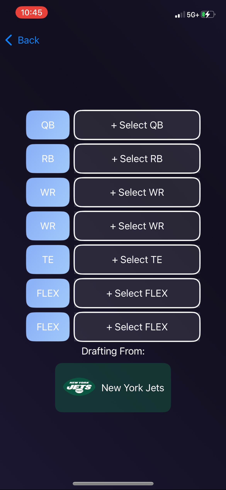

### June 20, 2025
I figured out a ~decent~ color scheme and went brandless to focus on functionality. I designed the three screens needed for the main gameplay flow.
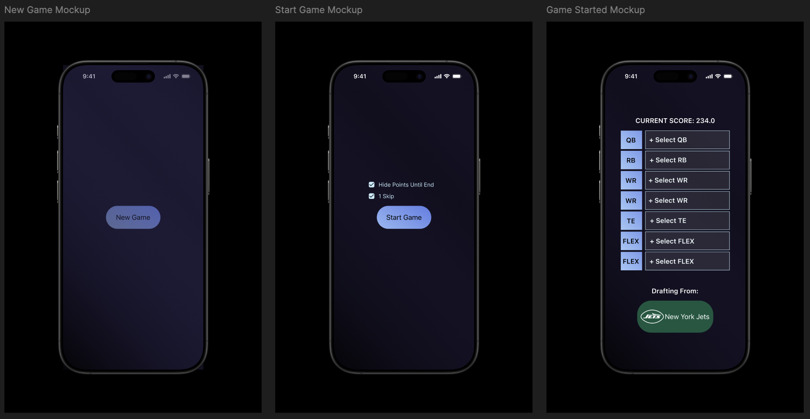

### June 18, 2025
Starting design with a simple auth screen to get comfortable with Figma and get a feel for the color scheme I wanted.
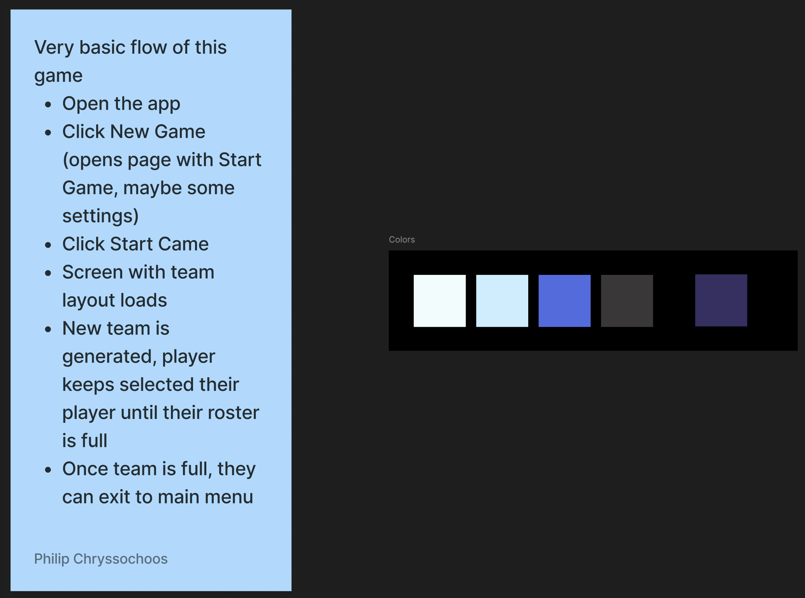
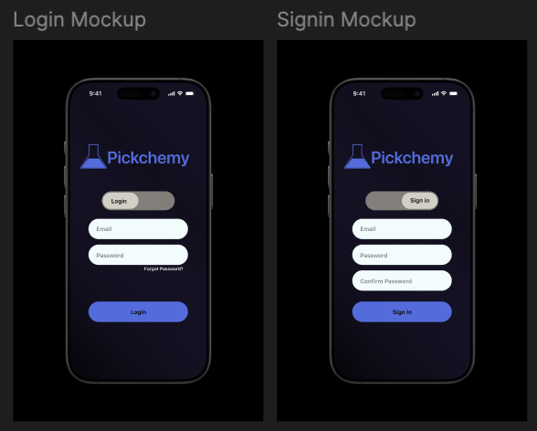
